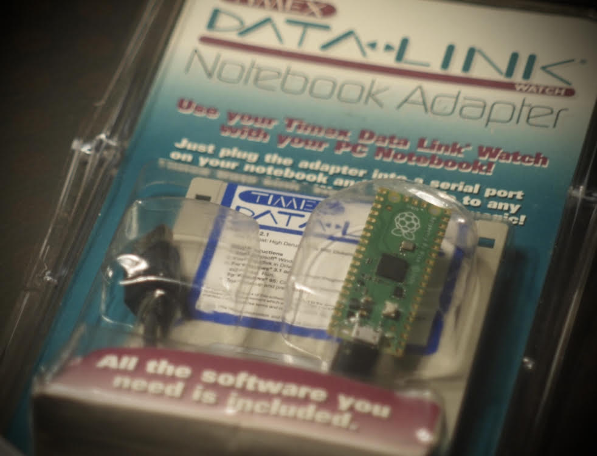
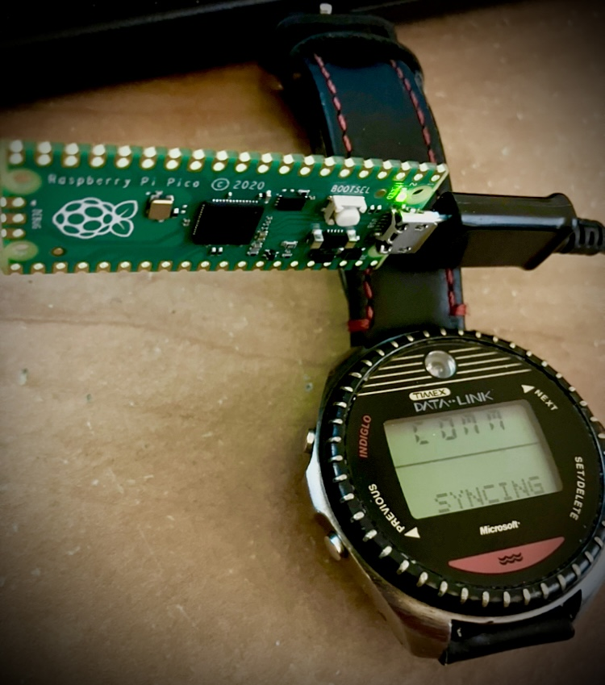
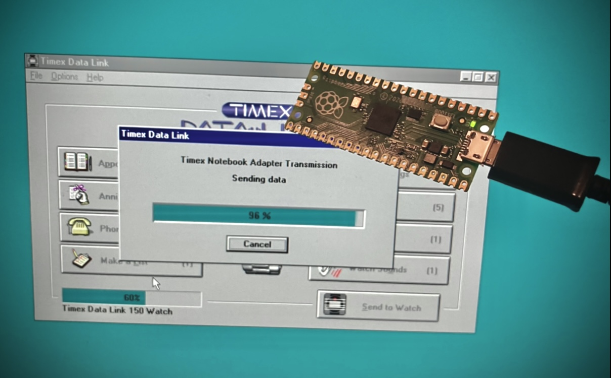
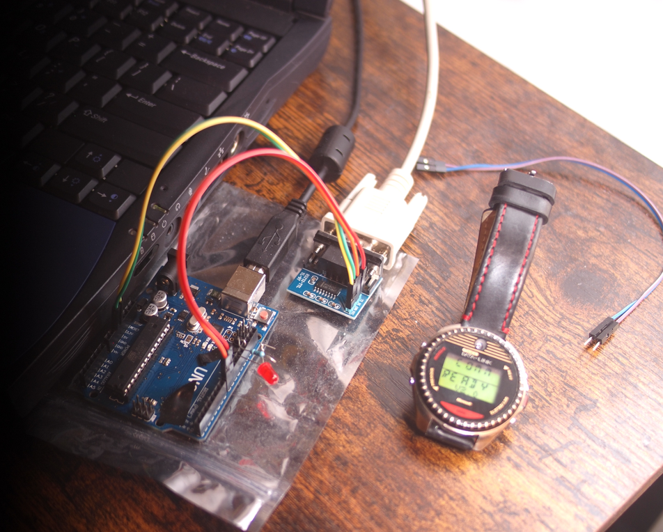
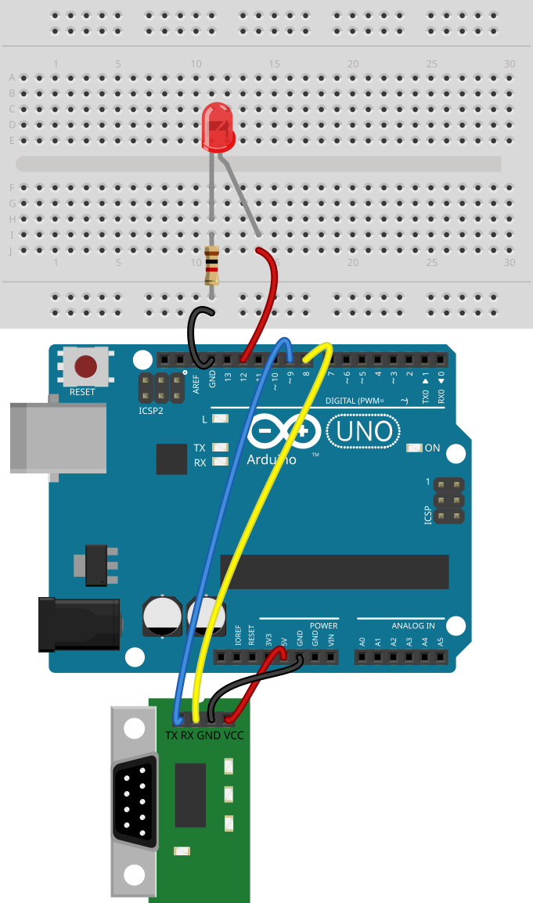

# DIY Datalink Adapter

This is a modern microcontroller based replacement for the [Notebook Adapter kit][Adapter_Wiki] used by the [Timex Datalink][Watch_Wiki] watch. It's compatible with the original software (and PC hardware), and eliminates the need for syncing the watch with a CRT monitor. 

There are now two versions:
-  USB version for the original Raspberry Pi Pico - Simplest setup if using the original Pico model, no hardware tinkering required. Primarily intended for use with a Virtual Machine. Note: Pico W requires external LED.*
-  DB9 version for the Arduino Uno - Some assembly required. Best used with original legacy hardware, but also works with a a Virtual Machine with or without a USB to serial adapter.

Use as you would the official Datalink Notebook Adapter, following in-app directions. 
You may need to shield the watch sensor from interference, like modern LED lightbulbs or even monitors.  

# Raspberry Pi Pico Version
 
## Requirements (Raspberry Pi Pico Version)
-  Original model of Raspberry Pi Pico if you want to just use the onboard LED. (Pico W users must use external LED, see below).
-  USB cable (with data line)
-  Download of DIY_Datalink_Pico.uf2
-  Legacy Windows Virtual Machine (tested with Windows 98 SE in VMWare Workstation 16)
-  [Timex Datalink watch][Watch_Wiki] (tested with Datalink 150)
-  No other hardware requirements for the original Pico, uses built-in LED.
-  External LED on GPIO pin 18 connected to 1k resistor on GND is required for Pico W, but is optional on original Pico.*

 
## Connecting it All (Raspberry Pi Pico Version)
-  Connect the Raspberry Pi Pico to the host PC while holding down the Pico's reset button. This should mount the Pico as a USB drive.
-  Drag and drop DIY_Datalink_Pico.uf2 onto the Pico's root folder, it should immediatley unmount itself and restart as a USB serial device.
-  After opening the Timex Datalink software, in the virtual machine settings, use the COM port assigned to the Pico and connect it. If you connect before opening the Datalink software, it may remount as a USB drive on the host. Be sure the USB device is connected to the host machine, but the serial port it presents to the OS is connected to the VM. (Legacy Windows may not be able to directly talk to the USB host device, drivers may not be available to accommodate this.) 
-  Use the Timex Datalink software as normal (2.1d is recommended). 

*If you are trying to use a Pico W, the internal LED hardware changed from a GPIO pin to go through the Wi-Fi chip. This method does not support the low-latency blinking that is required for this project, which is why an external LED is required. 

 
# Arduino Version
 
## Requirements (Arduino Version)
-  [Arduino Uno][ArduinoUno] (this should be compatible with other Arduino boards or similar microcontrollers, but it's only been tested on an Uno R3)
-  [Arduino software][ArduinoSoft] to upload the .ino file to an Arduino Uno
-  Software libraries for Arduino (see below)
-  [RS232 TTL hat][TTL_Hat] (I used Anmbest MAX3232 3.3V to 5V DB9 Male RS232 on Amazon)
-  [Red LED][LEDs] (with [1k resistor][ResistorKit] on GND between LED's ground wire) Note: You may need to try a clear LED if red doesn't work.
-  4-6 short [wires with Dupont connectors][DupontWire] that are male on one end, female on the other
-  [Null modem cable][NullModem] to connect TTL adapter to PC
-  Windows 9x PC or virtual machine with serial port and Timex Datalink software installed (verified with 2.1d). Windows 3.x or even [Wine][Wine] may also work, but are untested.
-  [Timex Datalink watch][Watch_Wiki] (tested with Datalink 150)
-  <b>Optional</b>: [USB to serial adapter][USB_Serial] for use with a virtual machine. It doesn't have to involve a DB9 connector, you can use a [USB to TTL][TTL_Direct] adapter directly without TTL hat. But you'll need additional [Dupont wires][DupontWire] with male on both ends.

The links above are specific to the US, and may not be available internationally. Even for US shoppers, the links will likely be inaccurate over time as things go out of stock. I recommend using Adafruit and Aliexpress for alternate sources that ship worldwide. If you can, try to find the same products I've recommended, as they have been tested with the project. 

## Libraries Used (Arduino Version)
This currently requires three Arduino libraries, add them with the Library Manager in the Arduino software.
-  AltSoftSerial (tested with version 1.4.0)
-  DigitalIO (tested with version 1.0.0)
-  SafeString (for millisDelay, tested with version 4.1.15)

## Connecting it all (Arduino Version)
Connect the Arduino Uno to RS232 TTL adapter using wires with Dupont connectors. Add an LED with 1k resistor. Power the Arduino Uno via USB. Connect null modem cable from the PC to the TTL adapter.  
 
-  Connect pin 9 on the Arduino Uno to TX on the TTL adapter (Note: RX and TX labels may be swapped on some TTL adapters)
-  Connect pin 8 on the Arduino Uno to RX on the TTL adapter (If the software isnt seeing the adapter: try swapping RX and TX)
-  Connect 5V on the Arduino Uno to VCC on the TTL adapter (<b>Warning</b>: some TTL adapters may accept or even require connecting 3V instead)
-  Connect any GND on the Arduino Uno to GND on to serialthe TTL  directlyadapter
-  Connect pin 12 on the Arduino, Uno to the postive/longer leg on the red LED
-  Connect any GND on the Arduino Uno to a 1k resistor and other end of resistor to the negative/short end on the red LED (you can just twist these together in a pinch)
-  Connect USB type B to power source (does not currently use USB for data/communication)
-  Connect null modem cable between TTL adapter and PC
-  If you're using a virtual machine, pass through the COM port to your VM. It's better not to pass through the USB to serial device directly. This is verified to work in [VMWare Workstation][VMWare]. 

## Troubleshooting (Arduino Version)

-  If the software isn't seeing the adapter, try swapping RX and TX. You should get a blink from the LED when the software is trying to send. 
-  Sometimes the Dupont connectors won't make a good connection. You might need to bend the male connectors a little to make better contact. Check with a multimeter or continuity tester to be sure. 
-  Know that while they look the same, null modem cables are different from serial cables. You may need to adapt a serial cable with a null modem adapter, or just try a different set of cables. 
-  When sending the sketch to the Arduino, check for errors. You should see an "Done uploading" message if everything went smoothly. 
-  If you're ever having issues, try using a terminal program like PuTTy (version 0.61 works in Win9x) to check for signs of life. When typing x it should echo x, if you type ? it should return a version number.
-  If your software doesn't like the adapter, make sure you're using the final version, 2.1d. The earliest versions don't support the adapter at all. 

## Troubleshooting (Pico Version)

-  Don't assign the Pico directly to the VM, just the COM port. I'm not aware of any working drivers for older OSes. 
-  If VMWare won't let you assign the COM port for the Pico, or causes it to re-mount as a storage device, try running a sync in the Timex software first.

# To-Do List 
-  One day I would like to add a 3D case to the project, especially since it would help focus the light away from interference. 

# Special Thanks
- [Antti Huhtala][Antti]
- excsniper on the Arduino Discord 🦆
- Selzby and leandromarceddu on the unofficial Pico Discord for their hints and encouragement
- PhiLho on a Processing.org forum post for their bitwise info

# Disclaimer
 I am not a professional programmer. This is my first Github project. Please be kind. 😬  
 Timex, Datalink, and DATA LINK are the registered trademarks of Timex Corporation.  This project is not associated with or sponsored by Timex.
 
[Antti]: <https://github.com/ahhuhtal>
[Watch_Wiki]: <https://en.wikipedia.org/wiki/Timex_Datalink>
[Adapter_Wiki]: <https://en.wikipedia.org/wiki/Timex_Datalink#Notebook_adapter>
[ArduinoUno]: <https://store-usa.arduino.cc/products/arduino-uno-rev3/>
[ArduinoSoft]: <https://www.arduino.cc/en/software/>
[LEDs]: <https://smile.amazon.com/eBoot-Pieces-Emitting-Diodes-Assorted/dp/B06XPV4CSH>
[ResistorKit]: <https://smile.amazon.com/Elegoo-Values-Resistor-Assortment-Compliant/dp/B072BL2VX1/>
[DupontWire]: <https://smile.amazon.com/SIM-NAT-Breadboard-Arduino-Raspberry/dp/B07RX78T9L/>
[NullModem]: <https://smile.amazon.com/StarTech-com-10-Feet-RS232-Serial-SCNM9FF/dp/B00006B8BJ>
[USB_Serial]: <https://smile.amazon.com/dp/B0753HBT12>
[TTL_Hat]: <https://smile.amazon.com/Anmbest-Converter-Connector-Raspberry-Microcontrollers/dp/B07LBDZ9WG/>
[TTL_Direct]: <https://www.sparkfun.com/products/17831>
[Wine]: <https://www.winehq.org/>
[VMWare]: <https://www.vmware.com/products/workstation-player/workstation-player-evaluation.html>
